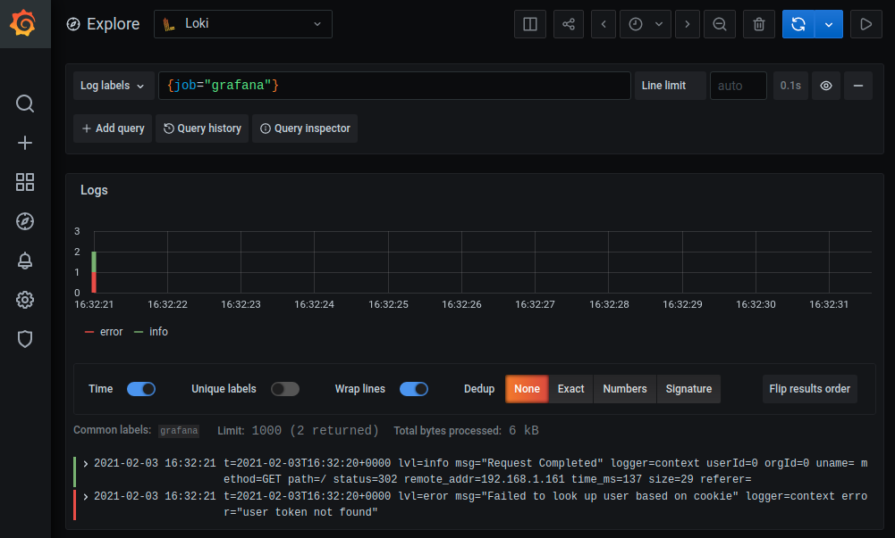

# Grafana configuration

This mostly relates to the work I'm doing to migrate from Splunk to Grafana Loki for log monitoring. I'll continue to update this as the set-up matures.

- `loki/` includes service configuration, and systemd service file
- `promtail/` ibid, for this agent

So far, Promtail is just monitoring /var/logs and Grafana's logs; the screenshot below shows a simple example of querying the latter, after setting Loki as a data source in Grafana.

## To do

- Set sensible limits in Loki
- Ingest systemd journal logs correctly
- Decide on a log ingestion strategy
  - doublestar; versus
  - Individual jobs
    - Is this the best way to set proper labels?
